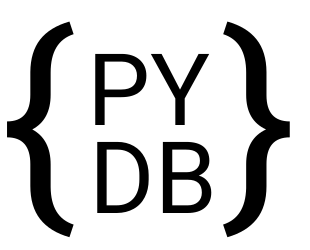

<p align="center">
  
</p> 

### What is the HawkDB project
Welcome! This project is a simple python3 library that uses .json files as a micro noSQL local database. While it is noSQL based database, it's functions are specifically designed with SQL statements in mind. HawkDB also enables you to write more complex and speed efficient queries.
(Shown in [Complex User Queries](#Complex-Queries)).

HawkDB was chosen as the final name for the project but the early name was PyDB

Check out [Disclaimer](#Disclaimer) 

## Table of Contents  
- [Disclaimer](#Disclaimer)  
- [SQL equivalent restructuring filters](#SQL-equivalent-restructuring-filter) 
- [SQL equivalent statements](#SQL-equivalent-statements) 
- [Complex User Queries](#Complex-Queries) 

## Disclaimer
**This is a proof of concept**. I developed this project to challenge myself learn about the internals of databases, software design and object oriented programming.

## Sample usage
```python
from Hawk import Pydb, Query

db = Pydb(connection="Users.json", tablename="Users")
User = Query(db)

print(db.length()) # int: number of columns

db.filter(User.name == "Yusuf")

print(db.all()) 
# List[Dict[str, Any]]: return columns where 
# that include -> {"name": "Yusuf"}

db.filter(User.age != 16)

print(db.all()) 
# List[Dict[str, Any]]: return table where 
# that don't include -> {"age": 16}

```
## SQL equivalent restructuring filter
### ALL
return result of query or whole table
```python
db.filter(User.name == "Yusuf")
print(db.all()) 
# List[Dict[str, Any]]: return columns where 
# that include -> {"name": 16} and limit to 5 return columns
```
### LIMIT
return number of rows up to a specified limit
```python
db.filter(User.age == 16)
print(db.limit(5)) 
# List[Dict[str, Any]]: return columns where 
# that include -> {"age": 16} and limit to 5 return columns
```
### ASC
Note: this is the natural order.
```python
db.filter(User.name == "Yusuf")
print(db.asc()) 
# List[Dict[str, Any]]: return columns where 
# that include -> {"name": "Yusuf"} 
```
### DESC
reverse of natural order
```python
db.filter(User.name == "Yusuf")

print(db.desc()) 
# List[Dict[str, Any]]: return columns where 
# that include -> {"name": "Yusuf"} and desc order
```

### TRIVAGO
is a hotel
you think this is a joke but i am 
serious this is an actual method
```python
db.trivago() 
```

## SQL equivalent statements
### SELECTALL
Equivalent to SELECT * FROM _TABLENAME_;<br>
returns a result table
```python
db.selectall()
```
### SELECT
Equivalent to SELECT column1, ... FROM _TABLENAME_;<br>
returns columns the include specified keys
```python
db.select(["name"])
```
### INSERT
Insert new column into database <br>
```python
db.insert({"name": "Yusuf", "age": 16,
        "money": None, "Python": True
        "Java": False})
```
### UPDATE
UPDATE table_name SET _column1_=_'value1'_, ... WHERE _column1_=_'value1'_; <br>
Update specific column(s) 
```python
db.update({"seal": True}, {"name": "Yusuf"})
# add {"seal": True} where {"name": "Yusuf"}
```
### TRUNCATE
TRUNCATE TABLE _TABLENAME_; <br>
This command is **irreversible** and deletes all data inside a table, but not the table itself.
```python
db.truncate()
```
### DELETE
Equivalent to DELETE FROM _TABLENAME_ WHERE _KEY_=_'VALUE'_;<br>
Drop all columns with same key and value
```python
db.delete({"name": "Yusuf"})
```

## Complex Queries
through the use of these functions you will have the ability to do anything with the database:

#### function release()
Return the whole table

Sample usage of **release()**
```python
from pydb import Pydb, Query

db = Pydb(connection="Users.json", tablename="Users")
# No need for Query class

table = db.release() #return the whole database: List[Dict[str, Any]]
query = []

for col in table: 
    if col.get("age") != None and col.get("age") > 20:
        # get all Users that are 20+
        query.append(col)

print(query)
```

#### function push()
Delete current database and push given table into database.

Sample usage of **push()**
```python
from pydb import Pydb, Query

db = Pydb(connection="Users.json", tablename="Users")
# No need for Query class

table = db.release() #return the whole database: List[Dict[str, Any]]
query_table = []

for col in table: 
    if col.get("age") != None and col.get("age") > 20:
        # get all Users that are 20+
        query_table.append(col)

db.push(query_table)
```


